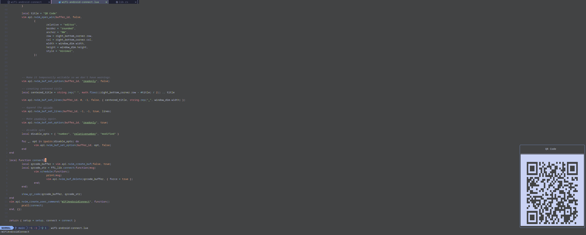

#   WIFI Android connect 

OS Support:

- **Linux only**
- it **might** work for macos
- it **might** work for windows


Connect to your device using QR code through the terminal (or neovim)

## run tests

```bash
cargo t
```

## run app

```bash
cargo r
```

## build NVIM plugin

```bash

chmod +x ./build.sh
./build.sh
```

## Example command line

https://github.com/user-attachments/assets/d62e718b-e43d-45ee-a279-208ca997c791

## neovim plugin

### How to install

with lazy.nvim:

```lua
{
    'samuel-cavalcanti/wifi-android-connect'

},
```

Default setup

```lua
local WIFI_QR_code = require("wifi-android-connect")
WIFI_QR_code.setup {
        timeout_in_seconds = 30
}
```


